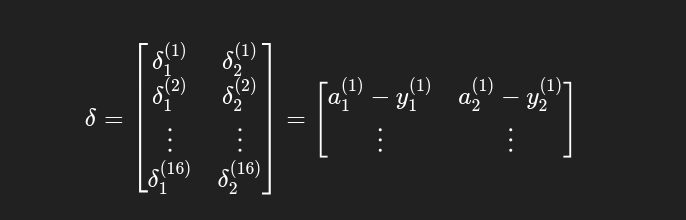
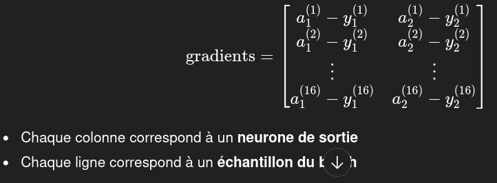
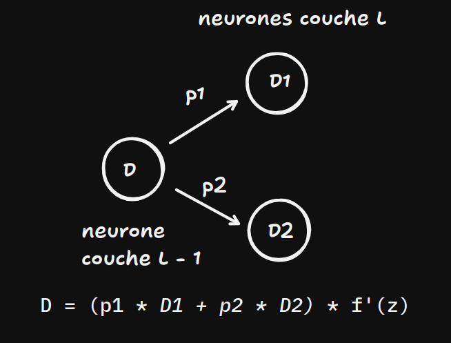
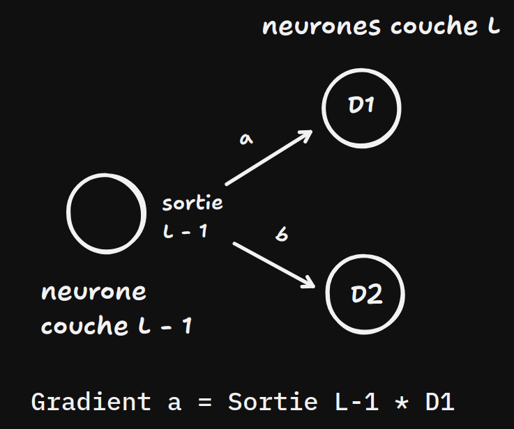

Ce projet consiste à créer un réseau de neurones modulable en s'inspirant de Keras.
Le but de ce projet est de comprendre comment entraîner un modèle en se basant sur un dataset puis d'effectuer des prédictions en se basant sur des données.
Le dataset au format csv contiendra des informations sur chaque échantillon et chaque échantillon aura une classe associée.

# Informations sur le projet

- Programme d'entraînement (main.py)
Le programme main.py récupère deux sets : un train set et validation set. Il utilisera comme fonction d'activation ReLU sauf pour la dernière couche contenant 2 neurones, dans ce cas, la fonction d'activation sera Softmax. La fonction coût utilisée est le CCE (Categorical Cross Entropy).

- Programme de prédiction (predict.py)
Le programme predict.py récupère automatiquement les paramètres générés par main.py et prend un validation set contenant la valeur cible. Il transforme aussi la dernière couche qui devient Sigmoid et a pour fonction de coût la fonction BCE (Binary Cross Entropy)

# Préparation du dataset
Un dataset doit être divisé en deux parties : le train set et le validation set.
Le validation set sera utilisé pour entraîner le modèle et le validation set pour effectuer des tests afin de s'assurer qu'il n'y a pas d'overfit.

# Etapes d'entrainement
Il y a 3 étapes : le forward propagation, back propagation et mise à jour des poids à l'aide d'un algorithme d'optimisation (généralement la descente de gradient).
Le forward propagation consiste à insérer des valeurs issues d'un dataset afin d'avoir une valeur pour la fonction de coût.
Puis vient l'étape de back propagation : on calcule des gradients (matrices contenant des informations sur les poids et biais associés entre chaque neurones de deux couches pour le poids et pour chaque neurone pour les biais)

# Batchs et epochs
On va utiliser plusieurs échantillons qui seront regroupés dans un batch afin d'optimiser l'apprentissage de notre modèle.
La taille des batchs est modulable, par défaut cette taille sera à 16. Cela signifie qu'à chaque itération (forward propagation, back propagation puis mise à jour des poids pour le train set), 16 échantillons du dataset train seront utilisés.
Pour le validation set, il n'y aura pas de back propagation et de descente de gradient (visant à modifier les poid et biais du modèle) car son but est uniquement de faire des tests sur les nouveaux paramètres (poids et biais) du modèle. Le validation set utilisera aussi des des batchs.

On parle d'epoch lorqu'on a traité tous les échantillons d'un set. Si le set contient 1000 échantillons et qu'un batch contient 10 échantillons. Alors il faudra faire 100 itérations sur chaque batch pour pouvoir traiter tout le set.
Généralement, il faut un epoch assez élevé pour bien entraîner le modèle et avoir les meilleurs paramètres possibles.
Des qu'un epoch sur le train set est fini, on passe au forward propagation du validation set. Quand le validation set a été traité en totalité, on entraîne à nouveau le modèle en passant à l'epoch suivant.

# Règle de la chaîne
La règle de la chaîne permet de calculer le gradient de la fonction perte par rapport aux poids, ce qui permettra de mettre à jour les paramètres du modèle.
Il faut calculer des valeurs appelées deltas, qu'on utilisera pour calculer les gradients de poids, de biais, et les deltas des couches de neurones précédentes.
On va donc devoir associer un delta à chaque neurone. Si le modèle utilise des batchs (comme c'est le cas ici), alors pour un même neurone, le delta sera différent dans chaque échantillon.


# Exemples de matrices utilisées avec numpy (exemple simplifié)
## Sigmoid + BCE
```
# 2 entrées dans un modèle avec un batch_size de 4
X = np.array([
     [0, 0],
     [0, 1],
     [1, 0],
     [1, 1]
 ])

# Chaque échantillon est associé à une valeur : 1 ou 0 (1 seul neurone dans la dernière couche)
y = np.array([[0], [1], [1], [0]])
```
## Softmax + CCE
```
# 2 entrées dans un modèle avec un batch_size de 4
X = np.array([ # Sortie de la couche d'entrée
     [0, 0],
     [0, 1],
     [1, 0],
     [1, 1]
 ])

# Chaque échantillon est associé à un one-hot : (2 neurones dans la dernière couche)
y = np.array([[0, 1], [0, 1], [1, 0], [1, 0]])
```
# Forward propagation
A chaque sortie d'une couche, chaque échantillon dans le batch aura une valeur de sortie différente pour le même neurone.
Par exemple si j'ai un batch size de 4 et que cette couche contient 10 neurones alors il y aura en sortie une matrice avec les 10 neurones pour chaque échantillon du batch.

Puis chaque sortie des neurones de chaque échantillon du batch est envoyée à la fonction d'activation afin d'être modifiée. Dans notre programme, l'instance de classe contenant notre fonction d'activation va sauvegarder les entrées (donc la sortie avant activation des neurones de la couche) afin de les utiliser par la suite dans l'étape de back propagation.
Ce qui signifie, que la matrice de sortie d'une couche de neurones aura la même forme que la matrice après application de la fonction coût. 

Arrivé à la dernière couche deux options s'offrent à nous : 
- Dans le programme main.py : la couche de sortie contient 2 neurones. On utilise donc la fonction d'activation softmax qui renverra une valeur entre 0 et 1 pour chacun des deux neurones de chaque échantillon dans le batch. Ensuite, on applique la formule du Categorical Cross Entropy (avec la version moyenne) : `-np.mean(np.sum(y_true * np.log(self.y_pred), axis=1))`
Cela renverra donc une valeur unique supérieure ou égale à 0. On fait donc la moyenne du résultat de la fonction perte de chaque échantillon et on applique le signe moins.
- Dans le programme predict.py : la couche de sortie contient 1 seul neurone. On utilise la fonction d'activation Sigmoid qui renvoie une valeur entre 0 et 1. Ensuite, on applique la formule du Binary Cross Entropy : `-np.mean(y_true * np.log(self.y_pred) +(1 - y_true) * np.log(1 - self.y_pred))`, la aussi ça renvoie une valeur unique pour tout le batch.

# Back propagation
La back propagation consistera à trouver les gradients. Ils nous permettront d'obtenir les nouveaux poids, biais et deltas.
Avant de pouvoir calculer les gradients de poids et de biais, il faut calculer les valeurs delta pour chaque neurones de chaque échantillon.
Si la dernière couche contient deux neurones et que j'ai un batch de 16 échantillons, alors il y aura 2 delta pour chaque échantillon dans la matrice renvoyée par la fonction cout CCE et fonction d'activation softmax.

La dernière couche dans le cadre d'un softmax / CCE ou Sigmoid / BCE sont particuliers. Je peux calculer directement les deltas a partir de la sortie de la fonction coût.



a1 représente la sortie du premier neurone après activation, a2 la deuxième sortie. y1 représente le premier index du one-hot et y2 représente le deuxième index du one-hot.

Pour les autres couches, des calculs plus complexes sont nécessaires pour calculer delta.
Si on ne tient pas compte du batch et qu'on considère qu'il n'y a qu'un seul échantillon, delta peut être calculé de cette manière :


Pour calculer un gradient de poids entre un neurone de la couche L - 1 et un neurone de la couche L, dans le cadre d'un seul échantillon et donc sans batch, on doit multiplier la sortie après activation du neurone de la couche L - 1 par le delta du neurone de la couche L.


Pour calculer le gradient de biais d'un neurone, c'est très simple. Il suffit juste de récupérer le delta associé à ce neurone. Aucun schema n'est nécessaire.


# Que se passe t'il si j'utlise un batch de 16 échantillons par exemple ?
## Pour les gradients de poids :
Si j'ai plusieurs gradients de poids issus de plusieurs échantillons pour une même connexion entre un neurone de la couche L - 1 et un neurone de la couche L : je dois faire la moyenne de tous ces gradients.

Le fait d'utiliser des matrices avec numpy facilite ce genre de calcul, n'hésitez pas à regarder le code pour mieux comprendre.
Mais vous deverz savoir que notre code est déjà optimisé pour ce genre de calcul, ne vous étonnez pas de ne pas voir la division directement à cette étape dans le code, elle a été faite au début de l'étape de back propagation.

## Pour les gradients de biais :
Si vous utilisez plusieurs échantillons pour calculer le gradient du biais d'un neurone, vous pouvez simplement faire la somme de tous les deltas associés à ce neurone dans chaque échantillon

## Pour les deltas
Grâce au calcul matriciel, chaque échantillon aura son propre delta pour chacun de ses neurones. Si une couche a 4 neurones et un batch size de 16, alors les 16 échantillons auront des valeurs différentes sur chacun des 4 neurones de cette couche.

# Descente de gradient
Il s'agît de la dernière étape de chaque epoch : mettre à jour les poids du modèle.
Dans notre cas, l'optimisation se fait grâce à ADAM : un algorithme d'optimisation s'inspirant du SGD Momentum et du RMSProp.
Avec le Momemtum les gradients de poids prédécent ont plus d'influence que les gradients de poids trouvé lors de l'itération.
Avec RMSProp le learning rate de chaque gradient poids est optimisé par rapport à son échelle.

# Fichiers
```
├── data.csv
├── export.pkl
├── graphs.py # Affichage des graphs
├── layers.py # Classes couche Dense et couche d'activation
├── loss_optimize.py # Algorithme d'optimisation et fonction perte
├── main.py # Configure le modèle (parametres, algorithmes utilisés...) et lance l'entrainement
├── predict.py # Charge les parametres (poids et biais) et prédit des valeurs
├── requirements.txt
├── sequential.py # Logique principale avec itération sur chaque batch
├── set.py # Crée les matrices contenant les données d'entrées et les sorties associées (one-hot ou une seule valeur)
├── split.py # Sépare le dataset en 2
├── train_set.csv
└── validation_set.csv
```

# Lancement du programme
## Préparer l'environnement python
```
python3 -m venv .venv
source .venv/bin/activate
pip install -r requirements.txt
```

## Programme split
```
python3 split.py data.csv 0.2
```

## Programme train
```
python3 main.py train_set.csv validation_set.csv
```

## Programme predict
```
python3 predict.py validation_set.csv export.pkl
```
